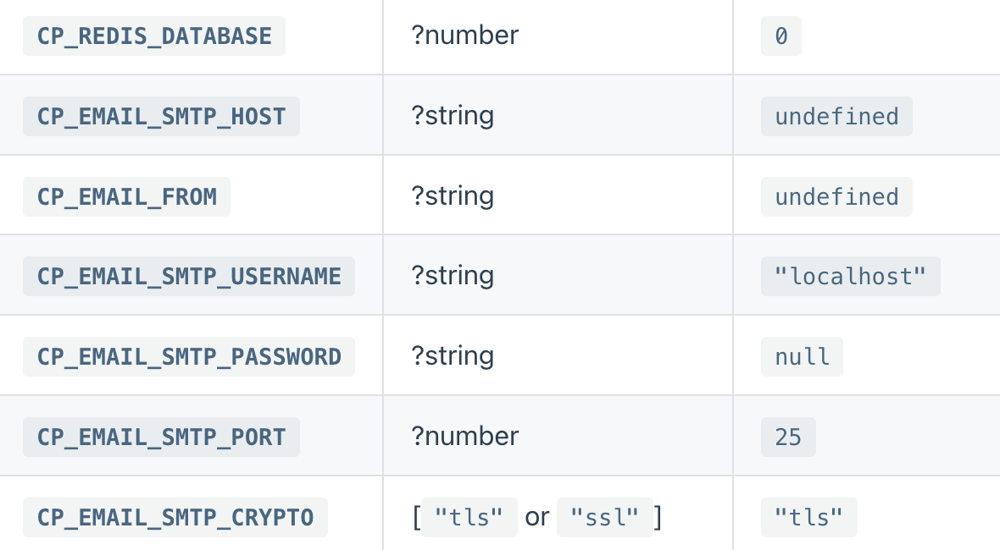
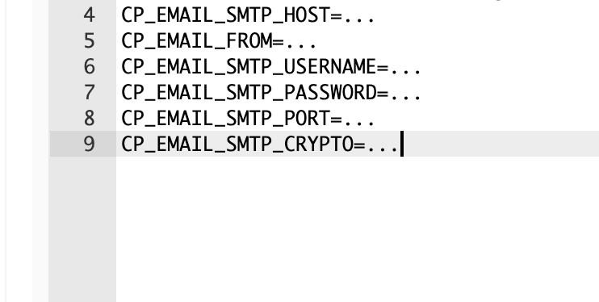

# Castopod CI/CD pipeline

Deploy Castopod server with CI/CD on Elestio

 
 

# Once deployed ...

You can can open Castopod UI here:

    URL: https://[CI_CD_DOMAIN]
    Login: [ADMIN_EMAIL]
    password: [ADMIN_PASSWORD]

# Installation

For your first connection, you must first create a user in this URL

        https://[CI_CD_DOMAIN]/cp-install

# Emails

If you want to configure an email messaging system, go to your pipeline, then to the Build & Deploy category and open the Environment variables tab.
Based on the image below, enter the information as shown in the second image, then, when finished, click on Apply Changes at the very top of the window, and restart your pipeline

